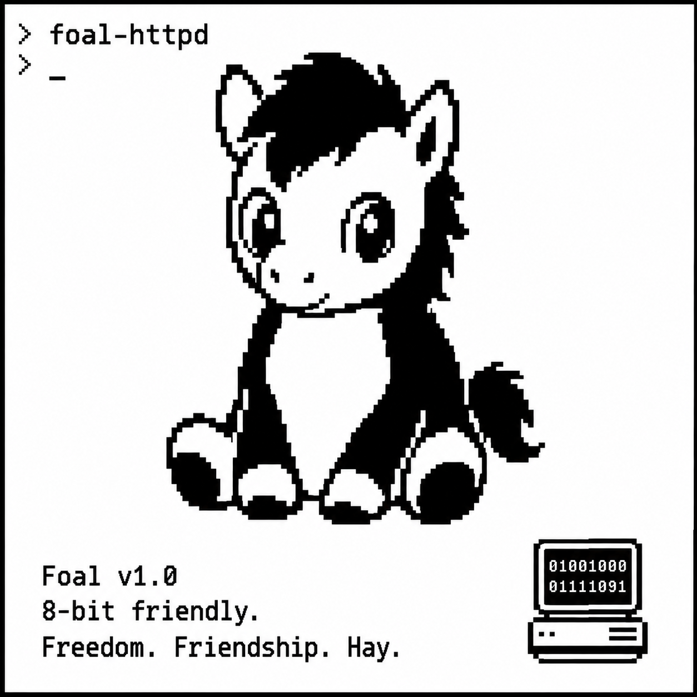

# foal-httpd

Minimal HTTP/1.0 static file server for [SymbOS](http://symbos.org), written in C using the [SCC compiler](https://github.com/danielgaskell/scc).

> **Proof of concept.** This is a toy server intended for experimentation on retro hardware. It handles one connection at a time, has a fixed 8 KB file cache, and has not been hardened for security or reliability. Do not use it for anything serious.

## Features

- All files in the docroot preloaded into RAM at startup — zero disk I/O during requests
- GET and HEAD methods
- MIME types: html, htm, txt, css, js, png, gif, jpg/jpeg
- Directory traversal protection (`..` in paths → 404)
- Query strings and fragments stripped before path lookup
- Default document: `index.htm` for `/`
- HTTP/1.0, `Connection: close` — one connection at a time
- Runs as a SymbOS daemon with a systray icon
- Double-launch guard (second instance exits immediately)
- Responds to OS quit messages (task manager) and Q key in SymShell

## Build

Requires SCC installed at `~/Dev/scc` (or set `SCC_HOME`):

```bash
./build.sh
```

Output: `build/httpd.com`

## Usage

```
httpd [port [docroot]]
```

| Argument | Default | Example |
|----------|---------|---------|
| `port` | 80 | `8080` |
| `docroot` | app directory | `C:\WWW` |

### Examples

```
httpd                    ; port 80, app directory
httpd 8080               ; port 8080, app directory
httpd 80 C:\WWW          ; port 80, serve from C:\WWW
```

Run from SymShell or the SymbOS file manager. On startup the server scans the docroot, caches all files, registers itself as a named service, and adds a systray icon. It then waits for connections in the background.

- **SymShell**: press **Q** to quit (checked between connections)
- **No shell / daemon mode**: quit via the SymbOS task manager or OS quit message

## File caching

At startup the server enumerates every file in the docroot using the SymbOS file manager (DIRINP command), caches them all into an 8 KB RAM pool, then closes all file handles. Any file present at startup is served from RAM; files not found return 404. The pool fits roughly 8 KB of content in total (`STORE_SIZE` in `src/httpd.c`).

## Sample site

A minimal example site is in `www/`:

```
www/
  index.htm   — sample HTML page (logo embedded as base64 data URI)
  logo.jpg    — source image (already embedded; not needed on the server)
```

Copy `www/index.htm` to your SymbOS docroot (e.g. `C:\WWW\`) before starting the server. The logo is embedded directly in the HTML as a base64 data URI, so the browser fetches the complete page — including the image — in a single HTTP request. This avoids the `ERR_CONNECTION_REFUSED` errors that would otherwise occur when a browser fires parallel asset requests against a single-connection HTTP/1.0 server.

## Notes

- Requires the SymbOS network daemon to be running
- SymbOS FAT paths use backslashes and 8.3 filenames (`C:\WWW\index.htm`)
- All files are read at startup; the USB drive may sleep safely during serving
- Total RAM pool for cached files: 8 KB (`STORE_SIZE` in `src/httpd.c`)
